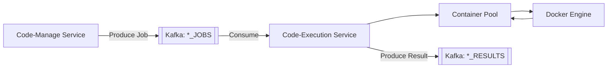
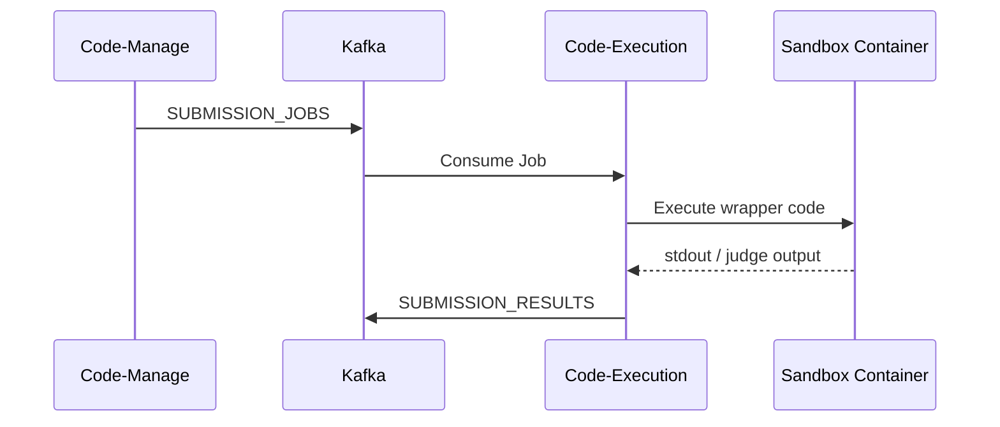
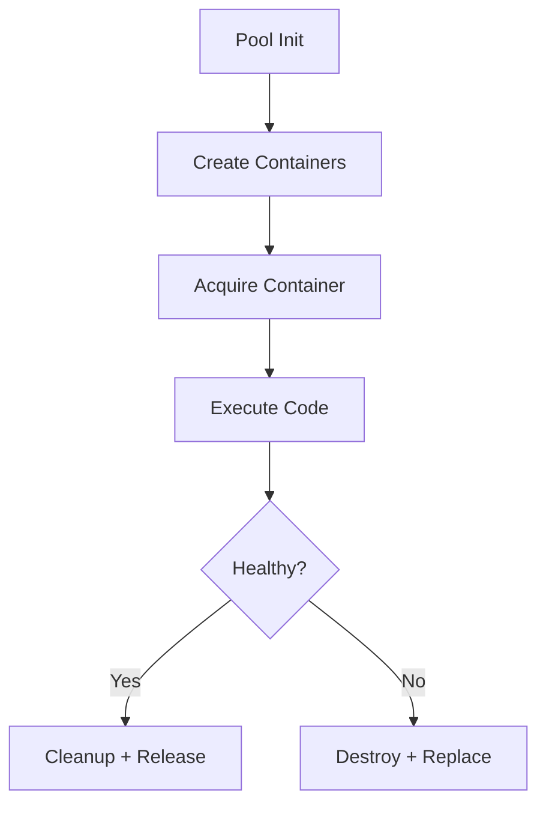
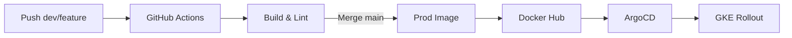

# Codex Code‑Execution Service

The **Code‑Execution Service** is the isolated execution engine of the Codex platform. It is a **purely asynchronous service** with **no HTTP or gRPC APIs exposed**. All business communication happens **exclusively through Kafka**, where the service consumes execution jobs and produces execution results.

For observability, the service exports traces and metrics **outbound to an OpenTelemetry collector using OTLP over gRPC**. This gRPC usage is strictly for telemetry transport only.

This service is responsible for securely running untrusted user code inside sandboxed Docker containers and reporting deterministic execution results back to the platform.

---

## 1. Service Overview

The Code‑Execution Service performs the following roles:

* **Kafka Consumer** for execution jobs
* **Secure code runner** using isolated Docker containers
* **Judge engine** for submissions and testcases
* **Kafka Producer** for execution results
* **Retry & DLQ participant** for fault‑tolerant execution

No inbound ports are exposed. All communication is asynchronous via Kafka topics.

---

## 2. Responsibilities

### Core Responsibilities

* Consume execution jobs from Kafka
* Execute untrusted code in sandboxed containers
* Enforce CPU, memory, time and network isolation
* Support multi‑language execution (JavaScript, Python, Go)
* Judge submissions against testcases
* Stream execution output and metrics
* Produce execution results back to Kafka
* Maintain container pool lifecycle
* Handle retries and DLQ safely

### Not Responsible For

* API handling or authentication
* Submission creation or persistence
* Result caching for clients
* Any synchronous request/response logic

These concerns are handled by **Gateway** and **Code‑Manage Service**.

---

## 3. High‑Level Architecture



---

## 4. Execution Flow

### 4.1 Submission Execution Flow



### Execution Modes

* **Submit Mode** – Stops on first failed testcase
* **Run Mode** – Executes all testcases and returns full results
* **Custom Mode** – Executes user code without judging

---

## 5. Kafka Subsystem

### Topics

```
SUBMISSION_JOBS     → submission execution jobs
SUBMISSION_RESULTS  → judged submission results
RUN_JOBS            → run‑only execution jobs
RUN_RESULTS         → run‑only results
CUSTOM_JOBS         → raw code execution jobs
CUSTOM_RESULTS      → raw execution output
RETRY_QUEUE         → redis‑scheduled retries
DLQ_QUEUE           → dead‑letter queue
```

### KafkaManager

The KafkaManager provides:

* Producer, consumer and admin lifecycle
* Manual offset control
* Redis‑backed retry scheduling
* Exponential backoff with jitter
* Retry worker loop
* DLQ routing
* Graceful shutdown

---

## 6. Container Pool System

The service maintains a **pre‑warmed container pool** to avoid cold starts.

### Container Pool Responsibilities

* Pre‑create a fixed number of containers
* Reuse healthy containers
* Track busy vs free containers
* Replace crashed or timed‑out containers
* Periodically monitor container health
* Enforce acquisition timeouts

### Pool Lifecycle



---

## 7. Secure Sandbox Design

Each execution runs inside a hardened Docker container with:

* **Non‑root user**
* **No network access** (`NetworkMode: none`)
* **No new privileges**
* **Strict filesystem permissions**
* **CPU & execution time limits**
* **Output size caps**

### Languages Supported

* **JavaScript** → Node.js
* **Python** → Python 3
* **Go** → Compiled binary execution

---

## 8. Execution Wrapper Code

The executed code is not raw user code. It is a **wrapper program** that:

* Injects helper utilities
* Wraps user logic in a controlled entrypoint
* Iterates testcases
* Measures execution time and memory
* Emits structured JSON output per testcase

The judge parses this output to compute results.

---

## 9. Judge Engine

### Judge Responsibilities

* Execute wrapper code once per job
* Parse structured testcase output
* Compare actual vs expected output
* Track passed/failed counts
* Capture peak time and memory usage

### Submission Rules

* **Submit Mode** → Stop on first failure
* **Run Mode** → Return all testcase results
* **Custom Mode** → No judging

---

## 10. Observability

### Logging

* Structured logs via **Pino**
* Correlated by `submissionId` / `tempId`
* Execution lifecycle visibility (consume → execute → produce)

### Tracing (OpenTelemetry)

Although this service exposes **no gRPC or HTTP APIs**, it **exports traces via OTLP over gRPC** to the OpenTelemetry Collector.

Instrumentation includes:

* KafkaJS consumer & producer spans
* Docker execution lifecycle spans
* Redis retry queue operations
* Internal execution and judge spans
* Pino log correlation

The service initializes OpenTelemetry using the **OTLP gRPC exporter**, with:

* `@opentelemetry/exporter-trace-otlp-grpc`
* `@opentelemetry/exporter-metrics-otlp-grpc`
* Auto‑instrumentation for KafkaJS, Redis, gRPC, and logging

This allows the Code‑Execution Service to participate in **distributed tracing** across the full Codex execution pipeline:

```
Gateway → Code‑Manage → Kafka → Code‑Execution → Kafka → Code‑Manage
```

Even though execution is fully asynchronous, traces remain end‑to‑end correlated via context propagation.

---

## 11. CI/CD Pipeline



No manual deployments.

---

## 12. Local Development

Install dependencies:

```
npm install
```

Run service:

```
npm run dev
```

Build image:

```
docker build -f Dockerfile.k8s -t codex/code-execution-service .
```

---

## 13. License

MIT
